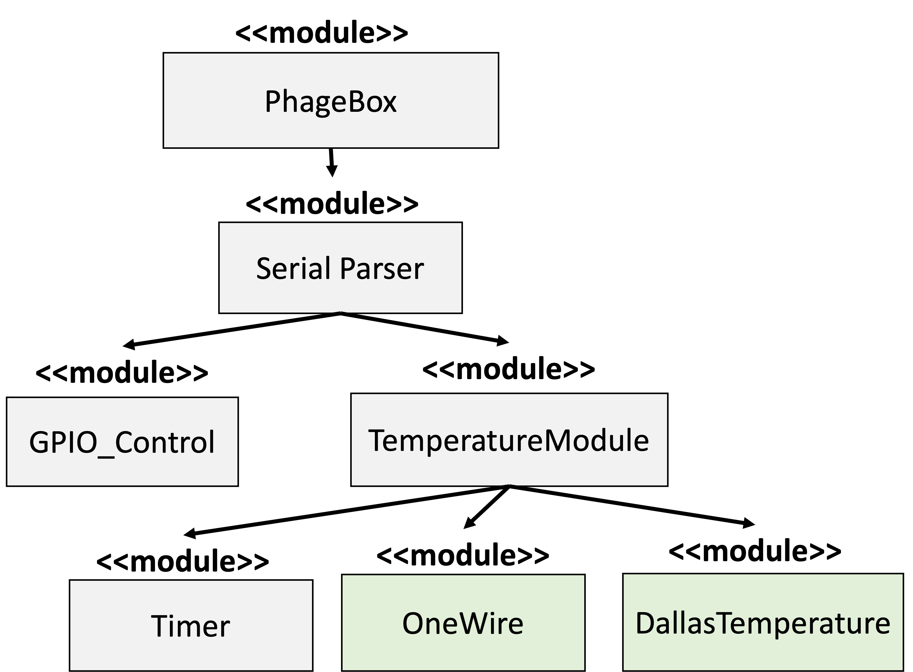

# Description

This repository contains a graphical user interface, arduino libraries, and modules that are used within PhageBox. Below are instructions for using this code base, as well as information for initiating the GUI.

## Building the PhageBox.

For building the phagebox, please review the build manual for a step-by-step build process.

## Graphial User Interface.

Please see the [GUI diagram](figures/GUI.pdf) for more information on what the GUI looks like once opened.

### Starting the GUI

General Usage:

```
usage: phagebox_app.py [-h] -s SERIAL_PORT [-m SLOPE] [-b INTERCEPT] [-v]

optional arguments:
  -h, --help            show this help message and exit
  -s SERIAL_PORT, --serial_port SERIAL_PORT
                        Specify the serial port
  -m SLOPE, --slope SLOPE
                        Slope of (Chip Temp vs Peltier Temp) [Default 1.2]
  -b INTERCEPT, --intercept INTERCEPT
                        y-intercept (Chip Temp vs Peltier Temp) [Default -2]
  -v, --verbose         prints output figures and debug info
```

Example (Mac):

```
python phagebox_app.py -s /dev/tty.usbserial-1430
```

Example (Windows):

```
python phagebox_app.py -s COM4
```

## Embedded Device Software.



### Install

To use this library, drag the entire contents of `src/phagebox_embedded/` into your local arduino libary and import. More detailed instructions can be found in the [arduino documentation](https://docs.arduino.cc/software/ide-v1/tutorials/installing-libraries).

### Arduino sketch example

This example uses an Arduino sketch to import the PhageBox library and initialize the embedded software. This sketch is also available here: `PhageBox/arduino/phagebox_controller/phagebox_controller.ino`

```
#include <PhageBox.h>

void setup()
{
    Serial.begin(9600);
    init_phagebox();
}

void loop()
{
    start_phagebox();
}
```

### Usage once library is installed

Once installed, you can send commands through Serial/UART for controlling backlight, magnetic module and temperature modules:

1. Heater 1 for 32 PCR cycles. **Cycles**: 15 seconds at 90C, 20 seconds at 50C, and 60 seconds at 72C.

```
<H,1,32,15,90,20,50,60,72>
```

2. Heater 2 for 32 PCR cycles. **Cycles**: 15 seconds at 90C, 20 seconds at 50C, and 60 seconds at 72C.

```
<H,2,32,15,90,20,50,60,72>
```

3. Toggle the LED

```
<B,0,1>
```

4. Toggle the MAGNET

```
<B,1,0>
```

5. Toggle both the MAGNET and LED

```
<B,1,1>
```
