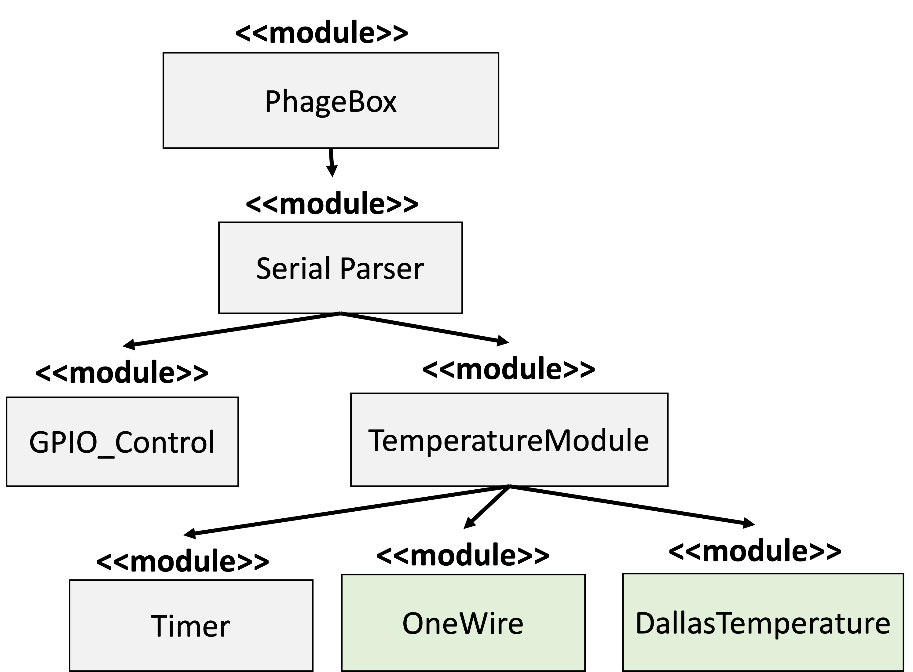

# PhageBox Arduino Library

## Description

The PhageBox is equipped with an embedded software library specifically tailored for its functions. The library consists of an embedded C/C++ implementation of PCR that utilizes a finite state machine to regulate cycle transitions. This implementation directly controls the device's GPIO registers at the hardware level and incorporates a timer for seamless state switching. The library's outcome is a finite state machine that effectively manages the peltier (heating) modules on the device.

### Block Diagram

The below outlines the software used to impliment the finite state machine controlled PCR.



## Usage

To use this library, drag the entire contents of `src/phagebox_embedded/` into your local arduino libary and import. More detailed instructions can be found in the [arduino documentation](https://docs.arduino.cc/software/ide-v1/tutorials/installing-libraries).

```
#include <PhageBox.h>

void setup()
{
    Serial.begin(9600);
    init_phagebox();
}

void loop()
{
    start_phagebox();
}
```

### Usage Instructions (instead of GUI control)

After installing the library, you can utilize the Serial/UART interface to send commands for controlling the backlight, magnetic module, and temperature modules. Here are some examples of the available commands:

1. Heater 1 Control.

You can use the following command to control Heater 1 for 32 PCR cycles. The cycles consist of 15 seconds at 90C, 20 seconds at 50C, and 60 seconds at 72C.

```
<H,1,32,15,90,20,50,60,72>
```

2. Heater 2 Control.

You can use the following command to control Heater 2 for 32 PCR cycles. The cycles consist of 15 seconds at 90C, 20 seconds at 50C, and 60 seconds at 72C.

```
<H,2,32,15,90,20,50,60,72>
```

3. Backlight Control.

You can use the following command to toggle the LED backlight:

```
<B,0,1>
```

4. Magnetic Module Control

You can use the following command to toggle the magnetic module:

```
<B,1,0>
```

5. Backlight and Magnetic Module Control

You can use the following command to toggle both the backlight and magnetic module:

```
<B,1,1>
```
